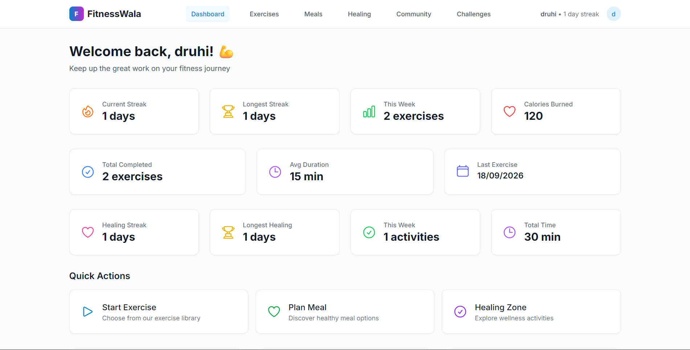

# FitnessWala

Full-stack wellness platform for building healthy routines and tracking goals through features such as: exercise tracking, meal planning, healing activities, community discussions, and shared challenges.
This project uses a React and TypeScript frontend and an Express, MongoDB, and JWT-backed API.



## Features

- **Dashboard** for progress, activity history, and streaks
- **Exercise library** with categories, difficulty levels, safety information, and completion tracking
- **Meal planning** with recipe details and nutritional information
- **Healing Zone** for meditation, breathing, Ayurvedic, therapy, and other wellness activities
- **Communities** with wellness-focused posts and discussions
- **Challenges** with participation and progress tracking
- **Authentication** with registration, login, protected routes, and JWT sessions

## Tech Stack

### Frontend

- React 19, Router, Hot Toast
- Tailwind CSS
- Axios
- Framer Motion

### Backend

- Node.js and Express
- MongoDB with Mongoose
- JWT authentication
- bcryptjs password hashing
- Helmet, CORS, rate limiting, and request validation

## Project Structure

```text
frontend/
    public/            # static assets and app metadata
    src/
        components/        # shared layout and ui components
        contexts/          # react context providers + auth
        pages/             # auth, dashboard, wellness, and community views
        services/          # api client and development data services
        types/             # shared ts domain types
        utils/             # helper functions (frontend)
    package.json           # frontend scripts and dependencies
    dockerfile             # development and production images
backend/
    middleware/            # authentication and request middleware
    models/                # mongoose schemas and data model
    routes/                # auth, users, wellness, social, and challenge api(s)
    scripts/               # db seed and maintenance scripts
    server.js              # api server entry point
    config.env             # local backend configuration template
    package.json           # backend scripts and dependencies
```

## Prerequisites

- Node.js 18 or newer
- npm
- MongoDB 4.4 or newer, running locally/through MongoDB Atlas

## Getting Started

### 1. Clone the repo

```bash
git clone https://github.com/rivuez/FitnessWala.git
cd FitnessWala
```

### 2. Configure and start the backend

```bash
cd backend
npm install
```

Update `backend/config.env` with your local MongoDB connection and a secure JWT secret:

```env
PORT=5001
MONGODB_URI=mongodb://localhost:27017/fitness_wala
JWT_SECRET=replace-with-a-secure-secret
NODE_ENV=development
```

Start the API in development mode:

```bash
npm run dev
```

The API is available at `http://localhost:5001`.

To load the seed data, run this from `backend/`:

```bash
npm run seed
```

### 3. Configure and start the frontend

In a second terminal:

```bash
cd frontend
npm install
npm start
```

The frontend is available at `http://localhost:3000` and uses `http://localhost:5001/api` by default.

To use another API URL, create `frontend/.env`:

```env
REACT_APP_API_BASE_URL=http://localhost:5001/api
```

## Available Scripts

Run these commands from the relevant directory.

### Frontend

| Command | Description |
| --- | --- |
| `npm start` | Start the development server |
| `npm run build` | Create a production build |
| `npm test` | Run the test suite |

### Backend

| Command | Description |
| --- | --- |
| `npm start` | Start the API |
| `npm run dev` | Start the API with Nodemon |
| `npm run seed` | Seed the database with sample data |

## API Overview

The API is organized around these resources:

- `/api/auth` - registration, login, logout, and current-user operations
- `/api/users` - profile management
- `/api/exercises` - exercise discovery, completion, and statistics
- `/api/meals` - meal discovery and completion
- `/api/healing` - healing activities, completion, and statistics
- `/api/communities` - wellness communities
- `/api/posts` - community posts
- `/api/challenges` - challenges and participation

See [backend/README.md](backend/README.md) for endpoint details and [frontend/INTEGRATION_GUIDE.md](frontend/INTEGRATION_GUIDE.md) for frontend-backend integration notes.

## Docker

The frontend includes development and production Docker configurations. From `frontend/`:

```bash
docker compose --profile dev up --build
```

See [frontend/DOCKER_README.md](frontend/DOCKER_README.md) for the available Docker workflows.

## Development Notes

- The frontend requires an authenticated user for the dashboard and wellness features.
- JWT tokens are stored in browser local storage for the current development setup. Review the authentication strategy before deploying to production.
- Keep `JWT_SECRET` and database credentials out of version control.
- Backend automated tests are not configured yet; the backend `test` script is currently a placeholder.

## Documentation

- [Frontend documentation](frontend/README.md)
- [Backend documentation](backend/README.md)
- [Backend API integration guide](frontend/INTEGRATION_GUIDE.md)
- [Backend API endpoint reference](backend/end_point.md)

## License

This project is licensed under the terms mentioned in [LICENSE](LICENSE).